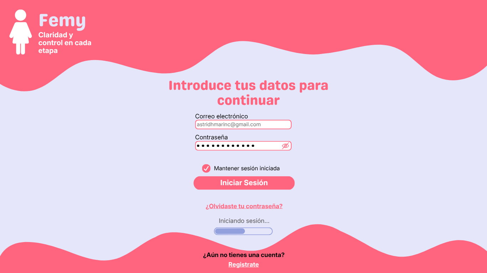
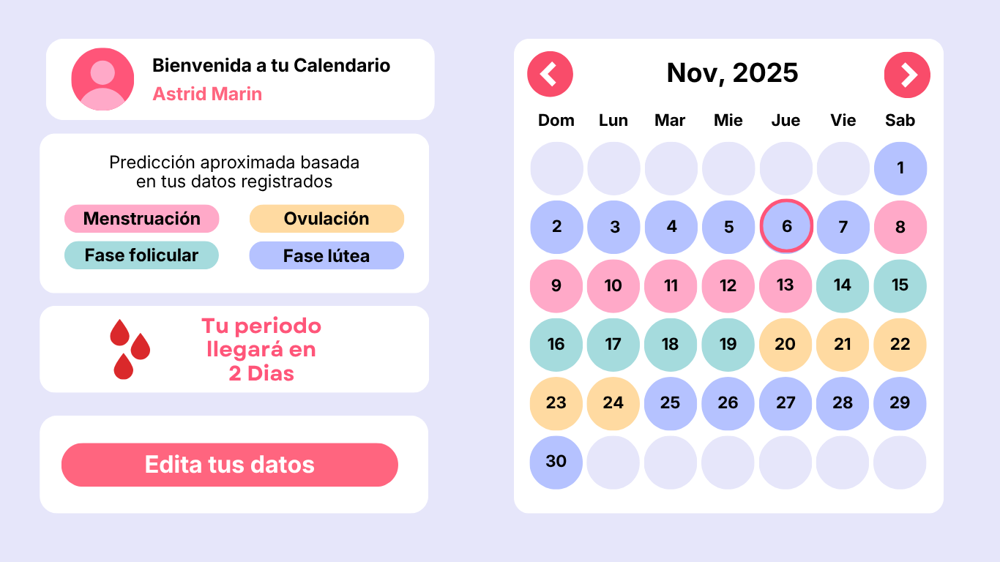

  

# **Femy**

## **Description**
**Femy** is a menstrual cycle management application designed to help women track, understand, and take control of their reproductive health. It provides tools for recording cycle data, monitoring symptoms, and visualizing patterns through an intuitive and user-centered interface. The project focuses on privacy, usability, and accessibility in women's health technology.

## **Table of Contents**
- [Description](#description)
- [Objectives](#objectives)
- [Project Status](#project-status)
- [Prototypes](#prototypes)
- [Technologies](#technologies)
- [Features](#features)
- [Access](#access)
- [Author](#author)
- [License](#license)

## **Objectives**
### General Objective
Develop a web application that allows users to manage their menstrual cycle efficiently, securely, and in a personalized way.
### Specific Objectives
- Track menstrual cycle events and patterns
- Monitor physical symptoms and emotional states
- Provide cycle predictions based on user data
- Ensure data privacy and security
- Design an intuitive and user-friendly interface

## **Project Status**
Femy is currently in the **analysis and design phase**.
### ♥ Completed
- Requirements gathering
- User stories definition
- UML diagrams
- Conceptual modeling
- Technical and economic proposal
- UI/UX prototypes design
### ♥ In Progress
- Documentation refinement
- Frontend development
- Database design (in progress)
### ♥ Planned
- Backend development
- System integration
- Testing and validation
- Deployment and optimization

## **Prototypes**
Femy's user interface has been designed using Canva, focusing on usability, accessibility, and a user-centered experience.
The prototypes illustrate the main features of the application, including cycle tracking, calendar visualization, and symptom monitoring.
🔗 View full prototype on Canva: [Open Prototype](https://canva.link/53g7upu7y0nxtcu)

## **Preview**

  
  

## **Technologies**
### Design and Prototyping
- Canva (UI design and mockups)
- Figma (UI/UX design and interactive prototypes)
### Planned Technologies
- Frontend: HTML, CSS, JavaScript (framework to be defined)
- Backend: Firebase / Node.js (based on technical proposal)
- Database: Firebase Firestore / MySQL
- Version Control: Git & GitHub
### Infrastructure
- Hosting: Firebase Hosting / Hostinger

## **Features**
### Authentication System
- User registration and login
- Secure password recovery flow
- Form validation and error handling
### User Setup
- Initial user data configuration
- Personalized experience based on user input
### Cycle Tracking
- Menstrual cycle recording
- Calendar-based visualization
- Cycle phase tracking
### Predictions and Insights
- Period prediction
- Fertility window estimation
### User Experience
- Intuitive and user-friendly interface
- Clean and minimal design
- Responsive feedback for user actions

## **Access**
- Repository: https://github.com/astridmarin/femy
- Documentation: https://drive.google.com/drive/folders/1_LBQuB2m6pITW91tMT9q3W8l9p3hxJGe?usp=sharing

## **Author**
**Astrid Hasbleidy Marin Carvajalino**  
Software Development Student at SENA
- GitHub: https://github.com/astridmarin

## **License**
This project will be licensed under the MIT License.